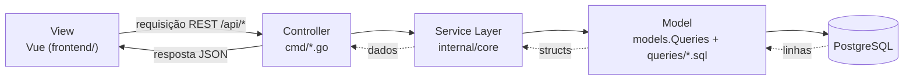
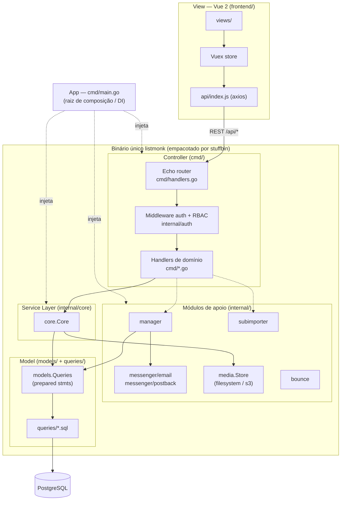
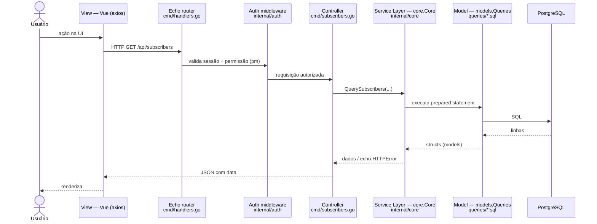

# Arquitetura do listmonk

## Arquitetura MVC

O listmonk é uma arquitetura MVC organizada dentro dos pacotes Go, e usa o design pattern
Service Layer entre o controller e o model. Os papéis:

- Model — `models/` e `queries/*.sql`: as structs de domínio e o SQL que fala com o
  PostgreSQL. É a única parte que acessa o banco.
- View — Vue em `frontend/`: a SPA que renderiza a interface e consome a API REST.
- Controller — os handlers HTTP em `cmd/*.go`: recebem a requisição, validam a entrada,
  aplicam permissões e devolvem JSON.
- Service Layer — `internal/core`: o design pattern que fica entre o controller e o model,
  concentrando as regras de negócio e o CRUD reutilizável. Os handlers finos delegam para o
  `core.Core`.

### Controller — `cmd/`

Handlers são métodos de `*App`, como `a.QuerySubscribers` e `a.CreateCampaign`, divididos por domínio em `cmd/subscribers.go`, `cmd/campaigns.go`, `cmd/lists.go` e afins. Fazem parsing e validação da entrada, aplicam permissões e serializam JSON. As rotas são registradas em `cmd/handlers.go`, na função `initHTTPHandlers`, que monta o roteador Echo, aplica o middleware de auth e envolve cada rota de API com `pm(handler, "perm:name")`. Os endpoints públicos ficam em `cmd/public.go`. As respostas seguem o padrão `{ "data": ... }` via `okResp`.

### Service Layer — `internal/core`

`core.Core` centraliza as regras de negócio e o CRUD reutilizável, com métodos como `Core.QuerySubscribers` e `Core.CreateCampaign` e arquivos espelhando os domínios dos handlers. É onde os handlers finos delegam o trabalho para não duplicar lógica. A separação é pragmática e não pura: por convenção o core retorna `echo.HTTPError` diretamente, então conhece o transporte HTTP, para os handlers repassarem o erro sem reescrevê-lo.

### Model — `models/` e `queries/`

SQL externalizado, sem ORM. `models.Queries` em `models/queries.go` é uma struct cujos campos são prepared statements anotados com `query:"..."`. No startup o SQL de `queries/*.sql`, no formato goyesql, é lido, parseado e refletido nessa struct. Isso isola o acesso ao banco atrás de operações nomeadas, um Table Data Gateway mais do que um Repository puro, já que não há mapeamento objeto-relacional. O DDL completo está em `schema.sql`.

### View — frontend

Vue 2 servida em `/admin`. `frontend/src/main.js` inicializa Vue, router e Vuex store. `frontend/src/api/index.js` é a instância única de axios, com interceptors de loading e conversão snake_case para camelCase. As views consomem a API por `Vue.prototype.$api`.

## Diagramas (Mermaid)

### Fluxo — Controller → Service Layer → Model → View

### Diagrama de componentes / pacotes

### Diagrama de sequência — fluxo de uma requisição autenticada

